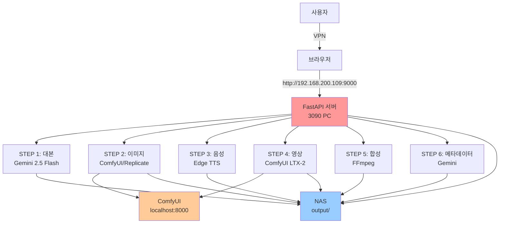

# 딸깍 (DdalGak) - 프로젝트 개요

> 뉴스 기사를 AI로 자동 유튜브 영상 제작 시스템

## 프로젝트 목적

딸깍은 뉴스 기사 텍스트를 입력하면 AI가 자동으로 다음 단계를 수행하여 유튜브 영상을 생성하는 웹 애플리케이션입니다:

1. **대본 생성** - Gemini 2.5 Flash로 기사를 40~55개 장면의 대본으로 변환
2. **이미지 생성** - ComfyUI(z-image), Replicate, Google API로 장면별 일러스트 생성
3. **음성 생성** - Edge TTS, Kokoro, ElevenLabs로 나레이션 음성 생성
4. **영상 생성** - ComfyUI LTX-2로 이미지를 움직이는 영상으로 변환
5. **영상 합성** - FFmpeg로 영상+오디오+자막을 최종 MP4로 합성
6. **메타데이터** - 유튜브 업로드용 제목, 설명, 썸네일 자동 생성

---

## 작업 환경

### 현재 구성

```
┌─────────────────────────────────────────────────────────┐
│ 외부 노트북 (작업 장소)                                  │
│ - VPN으로 NAS 접속                                       │
│ - VSCode로 원격 개발                                     │
│ - 브라우저로 http://192.168.200.109:9000 접속            │
└────────────────┬────────────────────────────────────────┘
                 │ VPN 터널
                 ▼
┌─────────────────────────────────────────────────────────┐
│ NAS (192.168.1.100)                                     │
│ - 프로젝트 소스 코드 저장                                │
│ - Z:\ddalgak (현재 경로: c:\ddalgak)                    │
│ - output/ 디렉토리 (결과물 저장)                         │
└────────────────┬────────────────────────────────────────┘
                 │ 내부 네트워크
                 ▼
┌─────────────────────────────────────────────────────────┐
│ 3090 GPU PC (DESKTOP-HIRPEEU, 192.168.200.109)          │
│ - ComfyUI 실행 (localhost:8000)                         │
│ - Python 서버 실행 (0.0.0.0:9000)                       │
│ - z-image turbo, LTX-2 모델 로컬 실행                   │
└─────────────────────────────────────────────────────────┘
```

### 주요 IP 주소

- **3090 PC**: 192.168.200.109 (현재 작업 머신)
- **NAS**: 192.168.1.100 (소스 코드 저장소)
- **ComfyUI**: http://localhost:8000 (3090 PC 로컬)
- **웹 서버**: http://192.168.200.109:9000 또는 http://localhost:9000

### 디렉토리 구조

```
c:\ddalgak (또는 Z:\ddalgak)
├── app/
│   ├── main.py              # FastAPI 앱
│   ├── config.py            # 환경 설정
│   ├── routes.py            # API 라우트
│   ├── pipeline/
│   │   ├── step1_script.py  # 대본 생성
│   │   ├── step2_images.py  # 이미지 생성
│   │   ├── step3_tts.py     # 음성 생성
│   │   ├── step4_video.py   # I2V 영상 생성
│   │   ├── step5_compose.py # FFmpeg 합성
│   │   ├── step6_metadata.py# 메타데이터
│   │   └── utils.py         # 유틸리티
│   ├── prompts/             # AI 프롬프트 템플릿
│   ├── templates/           # HTML 템플릿
│   └── static/              # JS, CSS
├── output/                  # 생성된 프로젝트 (NAS 경로)
│   └── 20260219_153929/     # 프로젝트 ID (timestamp)
│       ├── input_article.txt
│       ├── script.json
│       ├── images/
│       ├── audio/
│       ├── videos/
│       └── final/
├── run.py                   # 서버 실행 스크립트
├── requirements.txt         # Python 의존성
└── .env                     # API 키 설정
```

---

## 아키텍처 다이어그램



---

## 주요 파일 설명

### 핵심 설정 파일

| 파일 | 설명 |
|------|------|
| `.env` | API 키 설정 (GEMINI_API_KEY, REPLICATE_API_TOKEN, ELEVENLABS_API_KEY, COMFYUI_BASE_URL) |
| `app/config.py` | 전체 환경 변수, 모델 설정, OUTPUT_DIR 경로 |
| `requirements.txt` | Python 패키지 의존성 |

### 파이프라인 모듈

| 파일 | 담당 | 주요 함수 |
|------|------|-----------|
| `step1_script.py` | 대본 생성 | `generate_script(article, category)` |
| `step2_images.py` | 이미지 생성 | `generate_single(scene, style, model)` |
| `step3_tts.py` | TTS 음성 | `generate_scene_audio(text, voice_id, speed)` |
| `step4_video.py` | I2V 영상 | `generate_single(image_path, prompt, mode)` |
| `step5_compose.py` | FFmpeg 합성 | `compose_video(script, images, audio)` |
| `step6_metadata.py` | 메타데이터 | `generate_metadata(script)`, `generate_thumbnail()` |

### 웹 인터페이스

| 파일 | 설명 |
|------|------|
| `app/main.py` | FastAPI 앱 초기화 |
| `app/routes.py` | API 엔드포인트 정의 (SSE 지원) |
| `app/templates/index.html` | 메인 웹 UI |
| `app/static/main.js` | 프론트엔드 로직 (SSE 처리) |

---

## 환경 설정 방법

### 1. 사전 요구사항

**3090 GPU PC:**
- Windows 11
- Python 3.10+
- CUDA 12.x
- ComfyUI 설치 (z-image turbo, LTX-2 모델)
- FFmpeg (PATH에 추가)

**NAS:**
- VPN 서버 (OpenVPN)
- 네트워크 공유 폴더 (Z:\ddalgak)

### 2. 초기 설정 (최초 1회)

```bash
# 1. 프로젝트 클론 (NAS에서 수행)
cd c:\
git clone <repo-url> ddalgak
cd ddalgak

# 2. 가상환경 생성
python -m venv venv
venv\Scripts\activate

# 3. 의존성 설치
pip install -r requirements.txt

# 4. .env 파일 생성
notepad .env
```

**.env 파일 내용:**
```bash
GEMINI_API_KEY=your_gemini_api_key
REPLICATE_API_TOKEN=your_replicate_token
ELEVENLABS_API_KEY=your_elevenlabs_api_key
COMFYUI_BASE_URL=http://localhost:8000
```

### 3. ComfyUI 실행 (3090 PC)

```bash
# ComfyUI 설치 경로로 이동
cd C:\Users\magicyi\AppData\Local\Programs\ComfyUI

# 외부 접속 허용 모드로 실행
python main.py --listen 0.0.0.0 --port 8000

# 또는 실행 파일 사용
ComfyUI.exe --listen 0.0.0.0 --port 8000
```

### 4. 딸깍 서버 실행

```bash
# 프로젝트 경로에서
cd c:\ddalgak
venv\Scripts\activate
python run.py
```

서버가 `http://0.0.0.0:9000`에서 시작됩니다.

### 5. 외부 접속

- **3090 PC 로컬**: http://localhost:9000
- **내부 네트워크**: http://192.168.200.109:9000
- **VPN 외부 접속**: http://192.168.200.109:9000

### 6. OUTPUT_DIR 설정 확인

`app/config.py`에서 OUTPUT_DIR이 NAS 경로로 설정되어 있는지 확인:

```python
OUTPUT_DIR = BASE_DIR / "output"  # c:\ddalgak\output 또는 Z:\ddalgak\output
```

---

## 빠른 시작 체크리스트

### 새 프로젝트 시작

1. ✅ VPN 연결 (외부에서 접속 시)
2. ✅ VSCode로 c:\ddalgak 열기
3. ✅ ComfyUI 실행 (localhost:8000 확인)
4. ✅ 터미널에서 `venv\Scripts\activate`
5. ✅ `python run.py`로 서버 시작
6. ✅ 브라우저로 http://localhost:9000 접속
7. ✅ 뉴스 기사 입력 후 "프로젝트 생성"

### 작업 재개 (Resume)

1. ✅ 기존 프로젝트 선택 (좌측 패널)
2. ✅ 진행 상태 확인
3. ✅ 이어서 작업 (이미 완료된 단계는 건너뜀)

---

## 주의사항

### ComfyUI 연동

- ComfyUI가 **반드시 먼저 실행**되어 있어야 함
- `COMFYUI_BASE_URL`이 .env와 일치해야 함
- ComfyUI 모델 파일들이 필요:
  - `z_image_turbo_bf16.safetensors` (이미지 생성)
  - `ltx-2-19b-dev-fp8.safetensors` (I2V 영상 생성)

### NAS 경로 주의

- OUTPUT_DIR을 NAS 경로로 설정해야 여러 PC에서 접근 가능
- 로컬 경로(`C:\Users\...`)로 설정 시 다른 PC에서 결과물을 볼 수 없음

### API 키 관리

- `.env` 파일은 절대 커밋하지 않기 (`.gitignore`에 포함)
- API 키 만료 시 `.env`만 업데이트하면 됨

---

## 문서 참조

- `PROJECT_GUIDE.md` - 상세 기술 가이드
- `FLOWCHART.md` - 전체 플로우 차트
- `ROADMAP.md` - 개선 로드맵
- `ROADMAP2_INFRA.md` - 인프라 확장 계획 (Docker, 결제 시스템)

---

## 문제 해결

### ComfyUI 연결 실패

```bash
# ComfyUI 실행 확인
curl http://localhost:8000/

# 포트 충돌 확인
netstat -ano | findstr :8000

# ComfyUI 재시작
```

### 이미지/영상 생성 실패

1. ComfyUI 모델 파일 확인
2. ComfyUI 웹 UI(http://localhost:8000)에서 워크플로우 테스트
3. `output/{project_id}/` 폴더 권한 확인

### VPN 연결 문제

- VPN 서버 상태 확인
- NAS IP 핑 테스트: `ping 192.168.1.100`
- 포트 포워딩 확인

---

마지막 업데이트: 2026-03-10
