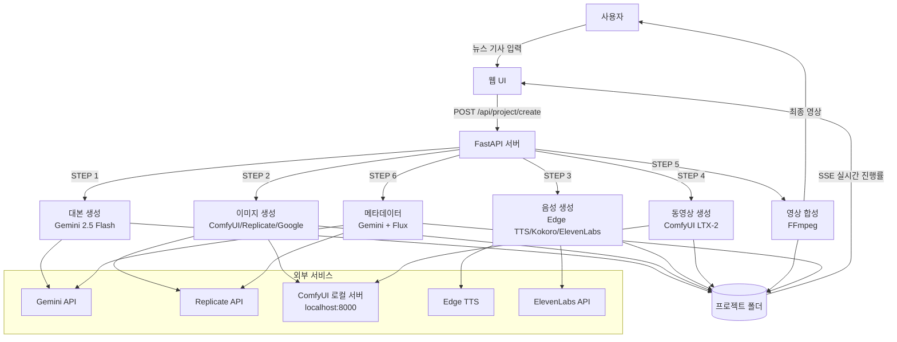
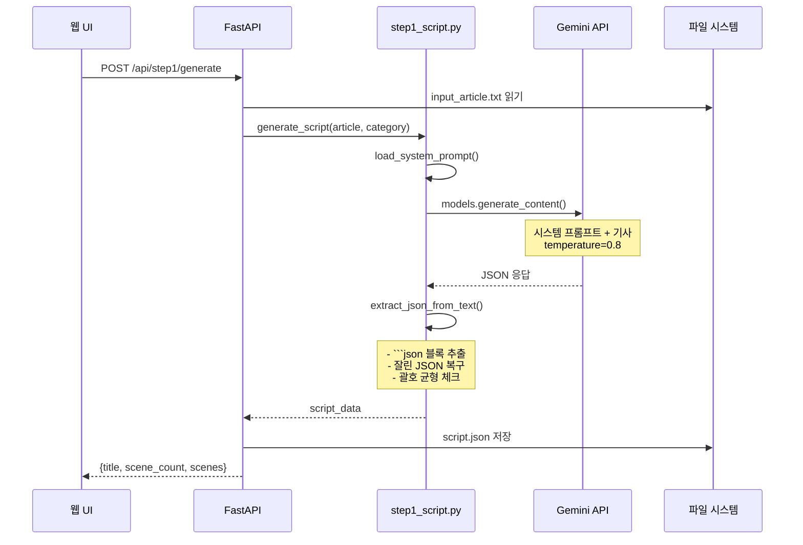
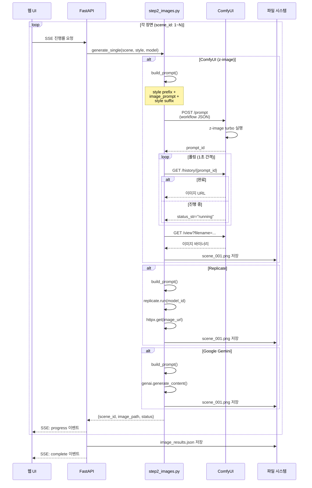
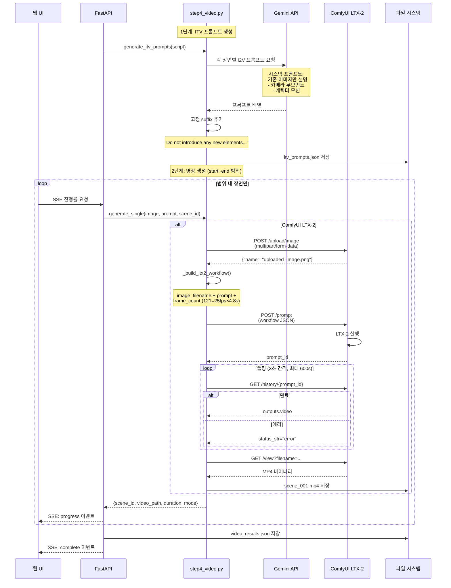
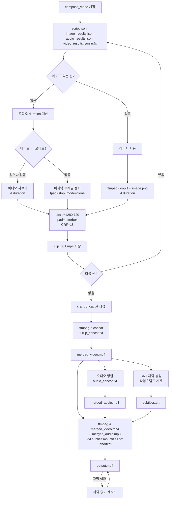
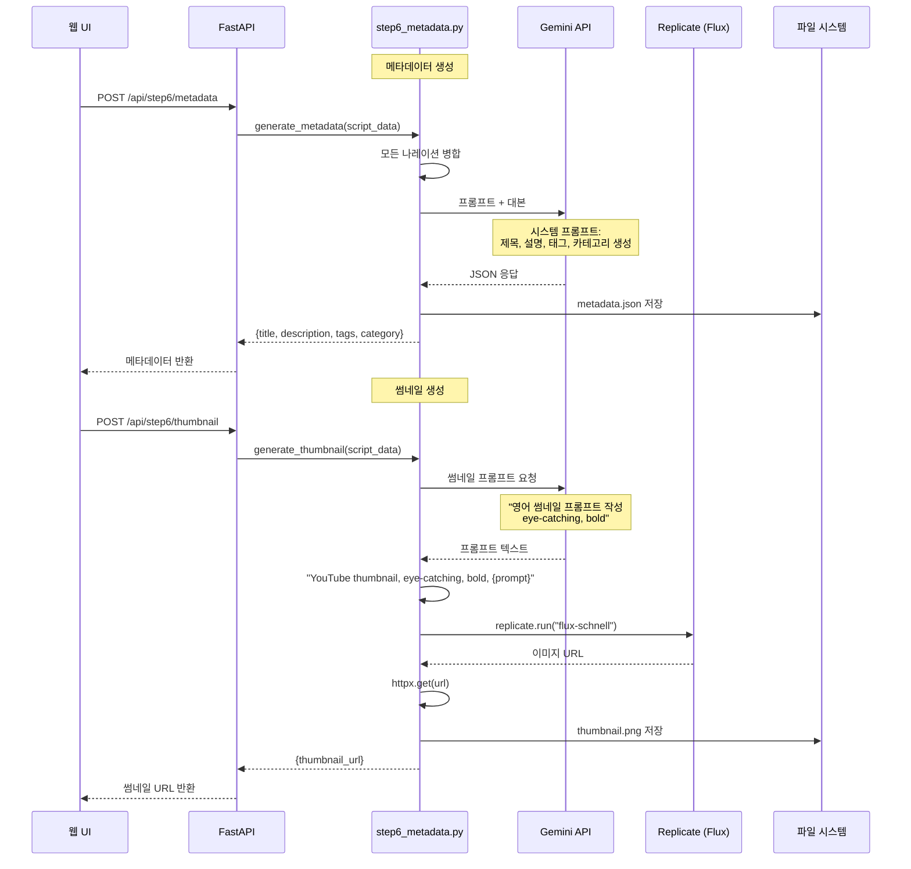

# 딸깍 (DdalGak) - 시스템 플로우 차트 & 상세 명세

> 전체 파이프라인의 구체적인 프로세스, 알고리즘, 데이터 구조 정의

---

## 목차

1. [전체 시스템 아키텍처](#1-전체-시스템-아키텍처)
2. [STEP 1: 대본 생성](#step-1-대본-생성)
3. [STEP 2: 이미지 생성](#step-2-이미지-생성)
4. [STEP 3: 음성 생성 (TTS)](#step-3-음성-생성-tts)
5. [STEP 4: 동영상 생성 (I2V)](#step-4-동영상-생성-i2v)
6. [STEP 5: 영상 합성](#step-5-영상-합성)
7. [STEP 6: 메타데이터 & 썸네일](#step-6-메타데이터--썸네일)
8. [데이터 구조](#데이터-구조)
9. [API 명세](#api-명세)

---

## 1. 전체 시스템 아키텍처



---

## 2. STEP 1: 대본 생성

### 플로우 차트



### 상세 알고리즘: JSON 복구 (utils.py)

```python
def extract_json_from_text(text: str) -> dict:
    """
    AI 응답에서 안정적으로 JSON 추출

    순서:
    1. ```json ... ``` 블록 추출 (정규식)
    2. JSON 시작점 ({ 또는 [) 찾기
    3. 원본 파싱 시도
    4. 흔한 오류 자동 수정:
       - 후행 콤마 제거 (,} → }, ,] → ])
       - 잘못된 이스케이프 수정
    5. 잘린 JSON 복구:
       - { 와 } 개수 카운트
       - [ 와 ] 개수 카운트
       - 부족한 닫는 괄호 추가
    """

    # 괄호 균형 계산
    brace_open = 0    # {
    bracket_open = 0  # [

    for char in fixed:
        if char == "{": brace_open += 1
        elif char == "}": brace_open -= 1
        elif char == "[": bracket_open += 1
        elif char == "]": bracket_open -= 1

    # 닫는 괄호 추가 (배열 먼저, 그 다음 객체)
    if bracket_open > 0:
        fixed += "]" * bracket_open
    if brace_open > 0:
        fixed += "}" * brace_open
```

### 입력/출력

**입력 (뉴스 기사):**
```
코스피가 어제 외국인 매도에 6%나 급락했습니다...
```

**출력 (script.json):**
```json
{
  "title": "코스피 대폭락! 개미들은 왜 빚투할까?",
  "scenes": [
    {
      "id": 1,
      "narration": "여러분, 지금 주식 시장이 심상치 않습니다. 코스피가 무려 6%나 급락하며 5,200선까지 주저앉았어요.",
      "image_prompt": "3D rendered, fluffy white Ragdoll cat character with blue eyes looking shocked at a downward trending red stock chart on a large monitor, soft lighting, vibrant colors"
    }
  ]
}
```

---

## 3. STEP 2: 이미지 생성

### 플로우 차트



### ComfyUI z-image 워크플로우 JSON 구조

```json
{
  "prompt": {
    "39": {
      "inputs": {
        "clip_name": "qwen_3_4b.safetensors",
        "type": "lumina2",
        "device": "default"
      },
      "class_type": "CLIPLoader"
    },
    "40": {
      "inputs": {"vae_name": "ae.safetensors"},
      "class_type": "VAELoader"
    },
    "41": {
      "inputs": {
        "width": 1024,
        "height": 576,
        "batch_size": 1
      },
      "class_type": "EmptySD3LatentImage"
    },
    "42": {
      "inputs": {"conditioning": ["45", 0]},
      "class_type": "ConditioningZeroOut"
    },
    "43": {
      "inputs": {
        "samples": ["44", 0],
        "vae": ["40", 0]
      },
      "class_type": "VAEDecode"
    },
    "44": {
      "inputs": {
        "seed": 12345,
        "steps": 9,
        "cfg": 1,
        "sampler_name": "res_multistep",
        "scheduler": "simple",
        "denoise": 1,
        "model": ["47", 0],
        "positive": ["45", 0],
        "negative": ["42", 0],
        "latent_image": ["41", 0]
      },
      "class_type": "KSampler"
    },
    "45": {
      "inputs": {
        "text": "사용자 프롬프트...",
        "clip": ["39", 0]
      },
      "class_type": "CLIPTextEncode"
    },
    "46": {
      "inputs": {
        "unet_name": "z_image_turbo_bf16.safetensors",
        "weight_dtype": "default"
      },
      "class_type": "UNETLoader"
    },
    "47": {
      "inputs": {
        "shift": 3,
        "model": ["46", 0]
      },
      "class_type": "ModelSamplingAuraFlow"
    },
    "9": {
      "inputs": {
        "filename_prefix": "ddalgak_img",
        "images": ["43", 0]
      },
      "class_type": "SaveImage"
    }
  }
}
```

### 프롬프트 빌딩 알고리즘

```python
def build_prompt(image_prompt: str, style_key: str, provider: str) -> str:
    """
    이미지 프롬프트에 스타일 접두사/접미사 추가

    스타일 예시 (animation):
    - prefix: "3D rendered, cute adorable animal characters, soft studio lighting..."
    - suffix: ", high quality 3D render, 4k, smooth, appealing, bokeh background"

    결과: "{prefix} {image_prompt}{suffix}"
    """
    styles = get_styles()
    style = styles.get(style_key, styles["animation"])

    if provider == "comfyui":
        # ComfyUI는 프롬프트를 그대로 사용 (스타일은 워크플로우에서 적용)
        return image_prompt

    # Replicate/Google은 스타일 접두사/접미사 추가
    return f"{style['prefix']} {image_prompt}{style['suffix']}"
```

---

## 4. STEP 3: 음성 생성 (TTS)

### 플로우 차트

```mermaid
sequenceDiagram
    participant UI as 웹 UI
    participant API as FastAPI
    participant S3 as step3_tts.py
    participant ET as Edge TTS
    participant KL as Kokoro (선택)
    participant EL as ElevenLabs (선택)
    participant FS as 파일 시스템

    loop 각 장면 (scene_id: 1~N)
        UI->>API: SSE 진행률 요청
        API->>S3: generate_scene_audio(text, voice_id, speed)

        S3->>S3: TTS_VOICES[voice_id] 조회

        alt Kokoro (영어/일본어)
            S3->>S3: _check_kokoro()
            Kokoro 설치됨?
            S3->>KL: KPipeline(lang_code)
            KL->>KL: pipeline(text, voice, speed)
            KL-->>S3: audio chunks
            S3->>S3: np.concatenate(chunks)
            S3->>FS: scene_001.wav 저장
        end

        alt ElevenLabs (한국어 윤아)
            S3->>EL: POST /text-to-speech/{voice_id}
            EL-->>S3: MP3 바이너리
            alt speed != 1.0
                S3->>S3: FFmpeg atempo 필터
            end
            S3->>FS: scene_001.mp3 저장
        end

        alt Edge TTS (기본)
            S3->>S3: 이벤트 루프 체크
            Note over S3: get_running_loop()?<br/>있으면 스레드에서 실행
            S3->>ET: Communicate(text, voice, rate)
            ET-->>S3: MP3 스트림
            S3->>FS: scene_001.mp3 저장
        end

        S3->>S3: _estimate_mp3_duration()
        S3-->>API: {scene_id, path, duration, engine}
        API-->>UI: SSE: progress 이벤트
    end

    API->>FS: audio_results.json 저장
    API-->>UI: SSE: complete 이벤트
```

### Edge TTS 이벤트 루프 처리 로직

```python
def _generate_edge(text: str, edge_voice: str, speed: float, output_path: Path) -> float:
    """
    Edge TTS 비동기 함수를 동기로 실행

    문제: FastAPI는 이미 이벤트 루프 실행 중
    해결: 새 스레드에서 새 이벤트 루프 생성
    """
    try:
        # 이미 실행 중인 이벤트 루프가 있는지 확인
        loop = asyncio.get_running_loop()

        # 새 스레드에서 실행
        result = [None]
        exception = [None]

        def run_in_new_loop():
            new_loop = asyncio.new_event_loop()
            try:
                result[0] = new_loop.run_until_complete(
                    _generate_edge_async(text, edge_voice, speed, output_path)
                )
            except Exception as e:
                exception[0] = e
            finally:
                new_loop.close()

        thread = threading.Thread(target=run_in_new_loop)
        thread.start()
        thread.join()

        if exception[0]:
            raise exception[0]
        return result[0]

    except RuntimeError:
        # 실행 중인 이벤트 루프가 없으면 기존 방식대로
        loop = asyncio.new_event_loop()
        try:
            return loop.run_until_complete(
                _generate_edge_async(text, edge_voice, speed, output_path)
            )
        finally:
            loop.close()
```

### 음성 엔진별 특징

| 엔진 | 지원 언어 | 출력 형식 | 속도 조절 | 특징 |
|------|-----------|-----------|-----------|------|
| Edge TTS | ko, en, ja | MP3 | rate 파라미터 (+-%) | 무료, 빠름 |
| Kokoro | en(미/영), ja | WAV | speed 파라미터 (0.5~2.0) | 로컬, 고품질 |
| ElevenLabs | ko | MP3 | FFmpeg atempo | 유료, 가장 자연스러움 |

### 속도 조절 공식

```
Edge TTS: rate = "+25%" → 1.25배속
Kokoro: speed = 1.25 → 1.25배속
ElevenLabs: ffmpeg -filter:a "atempo=1.25"
```

---

## 5. STEP 4: 동영상 생성 (I2V)

### 플로우 차트



### ComfyUI LTX-2 워크플로우 JSON 구조 (핵심 노드)

```json
{
  "prompt": {
    "98": {
      "inputs": {"image": "uploaded_image.png"},
      "class_type": "LoadImage"
    },
    "102": {
      "inputs": {
        "longer_edge": 1536,
        "images": ["98", 0]
      },
      "class_type": "ResizeImagesByLongerEdge"
    },
    "92:3": {
      "inputs": {
        "text": "Slow cinematic zoom in...",
        "clip": ["92:60", 0]
      },
      "class_type": "CLIPTextEncode"
    },
    "92:4": {
      "inputs": {
        "text": "blurry, low quality, still frame...",
        "clip": ["92:60", 0]
      },
      "class_type": "CLIPTextEncode"
    },
    "92:43": {
      "inputs": {
        "width": [이미지 너비],
        "height": [이미지 높이],
        "length": [frame_count],
        "batch_size": 1
      },
      "class_type": "EmptyLTXVLatentVideo"
    },
    "92:107": {
      "inputs": {
        "strength": 1,
        "vae": ["92:1", 2],
        "image": ["92:99", 0],
        "latent": ["92:43", 0]
      },
      "class_type": "LTXVImgToVideoInplace"
    },
    "92:41": {
      "inputs": {
        "noise": ["92:11", 0],
        "guider": ["92:47", 0],
        "sampler": ["92:8", 0],
        "sigmas": ["92:9", 0],
        "latent_image": ["92:56", 0]
      },
      "class_type": "SamplerCustomAdvanced"
    },
    "75": {
      "inputs": {
        "filename_prefix": "ddalgak_i2v",
        "video": ["92:97", 0]
      },
      "class_type": "SaveVideo"
    }
  }
}
```

### LTX-2 워크플로우 데이터 흐름

```
이미지 업로드 (LoadImage)
    ↓
리사이즈 (1536px 더 긴 에지)
    ↓
VAE 인코딩 → 이미지 잠재
    ↓
빈 비디오 잠재 생성 (frame_count=121)
    ↓
이미지 잠재를 비디오 잠재에 주입 (ImgToVideoInplace)
    ↓
CLIP 텍스트 인코딩 (positive, negative)
    ↓
샘플링 (KSampler + LTXVScheduler)
    ↓
VAE 디코딩 → 비디오 프레임
    ↓
MP4 저장 (SaveVideo)
```

### ITV 프롬프트 자동 생성

```python
# 입력 (scene)
{
  "id": 1,
  "narration": "여러분, 지금 주식 시장이 심상치 않습니다...",
  "image_prompt": "3D rendered, fluffy white Ragdoll cat character..."
}

# Gemini 요청
system_prompt = """
You are an I2V prompt specialist.
Rules:
1. ONLY describe what is ALREADY in the image
2. Describe camera movement: slow zoom, gentle pan
3. Describe subtle character motion: blinking, nodding
4. NO new elements, NO morphing, NO text overlay
5. Max 150 characters
6. Return JSON array: ["prompt1", "prompt2", ...]
"""

# Gemini 응답
["Slow cinematic zoom in with subtle ambient movement"]

# 고정 suffix 추가
final_prompt = "Slow cinematic zoom in with subtle ambient movement. \
Do not introduce any new elements. \
No new characters, animals, people, or props... \
Only animate what already exists in the image with slow, gentle motion."
```

---

## 6. STEP 5: 영상 합성

### 플로우 차트



### FFmpeg 명령어 상세

#### 1) 비디오 클립 생성 (동영상 있는 씬)

```bash
# 비디오가 오디오보다 길 때: 자르기
ffmpeg -y \
  -i scene_001.mp4 \
  -t 5.234 \
  -vf "scale=1280:720:force_original_aspect_ratio=decrease,pad=1280:720:(ow-iw)/2:(oh-ih)/2:black" \
  -c:v libx264 -preset fast -crf 18 \
  -an -pix_fmt yuv420p \
  clip_001.mp4

# 비디오가 오디오보다 짧을 때: 마지막 프레임 정지
ffmpeg -y \
  -i scene_001.mp4 \
  -vf "tpad=stop_mode=clone:stop_duration=1.5,scale=1280x720:force_original_aspect_ratio=decrease,pad=1280:720:(ow-iw)/2:(oh-ih)/2:black" \
  -t 5.234 \
  -c:v libx264 -preset fast -crf 18 \
  -an -pix_fmt yuv420p \
  clip_001.mp4
```

#### 2) 이미지 클립 생성 (정적 이미지 씬)

```bash
ffmpeg -y \
  -loop 1 \
  -i scene_001.png \
  -t 5.234 \
  -vf "scale=1280:720:force_original_aspect_ratio=decrease,pad=1280:720:(ow-iw)/2:(oh-ih)/2:black" \
  -c:v libx264 -preset fast -crf 18 \
  -an -pix_fmt yuv420p \
  -r 30 \
  clip_001.mp4
```

#### 3) 클립 연결

```bash
# clip_concat.txt
file 'clip_001.mp4'
file 'clip_002.mp4'
file 'clip_003.mp4'

ffmpeg -y \
  -f concat -safe 0 \
  -i clip_concat.txt \
  -c copy \
  merged_video.mp4
```

#### 4) 오디오 병합

```bash
# audio_concat.txt
file 'scene_001.mp3'
file 'scene_002.mp3'
file 'scene_003.mp3'

ffmpeg -y \
  -f concat -safe 0 \
  -i audio_concat.txt \
  -c copy \
  merged_audio.mp3
```

#### 5) 최종 합성 (자막 포함)

```bash
ffmpeg -y \
  -i merged_video.mp4 \
  -i merged_audio.mp3 \
  -vf "subtitles=subtitles.srt:force_style='FontSize=20,FontName=NanumGothic,PrimaryColour=&H00FFFFFF,OutlineColour=&H00000000,Outline=2,MarginV=30'" \
  -c:v libx264 -preset medium -crf 18 \
  -c:a aac -b:a 192k \
  -pix_fmt yuv420p \
  -shortest \
  output.mp4
```

### SRT 자막 생성 알고리즘

```python
def generate_srt(scenes: list[dict], durations: list[float]) -> str:
    """
    SRT 자막 생성

    타임스탬프 형식: HH:MM:SS,mmm

    로직:
    current_time = 0.0
    for each scene:
        start = current_time
        end = current_time + durations[i]
        write_srt_entry(i+1, start, end, scene['narration'])
        current_time = end
    """
    srt_content = []
    current_time = 0.0

    for i, scene in enumerate(scenes):
        start = current_time
        end = current_time + durations[i]

        # 시간 포맷팅
        def fmt(t):
            h = int(t // 3600)
            m = int((t % 3600) // 60)
            s = int(t % 60)
            ms = int((t - int(t)) * 1000)
            return f"{h:02d}:{m:02d}:{s:02d},{ms:03d}"

        srt_content.append(f"{i+1}")
        srt_content.append(f"{fmt(start)} --> {fmt(end)}")
        srt_content.append(scene['narration'])
        srt_content.append("")

        current_time = end

    return "\n".join(srt_content)
```

---

## 7. STEP 6: 메타데이터 & 썸네일

### 플로우 차트



---

## 8. 데이터 구조

### 프로젝트 폴더 구조

```
output/
└── 20260310_004332/          # 프로젝트 ID (timestamp)
    ├── input_article.txt     # 입력 뉴스 기사
    ├── script.json           # 생성된 대본
    ├── image_results.json    # 이미지 생성 결과
    ├── audio_results.json    # 오디오 생성 결과
    ├── video_results.json    # 비디오 생성 결과
    ├── metadata.json         # 메타데이터
    ├── itv_prompts.json      # I2V 프롬프트
    ├── images/               # 장면별 이미지
    │   ├── scene_001.png
    │   ├── scene_002.png
    │   └── ...
    ├── audio/                # 장면별 오디오
    │   ├── scene_001.mp3
    │   ├── scene_002.mp3
    │   └── ...
    ├── videos/               # 장면별 영상
    │   ├── scene_001.mp4
    │   ├── scene_002.mp4
    │   └── ...
    ├── temp_clips/           # FFmpeg 중간 파일
    │   ├── clip_001.mp4
    │   └── ...
    ├── final/                # 최종 결과물
    │   ├── output.mp4
    │   ├── subtitles.srt
    │   └── thumbnail.png
    ├── audio_concat.txt      # 오디오 병합 리스트
    ├── clip_concat.txt       # 비디오 클립 리스트
    └── merged_audio.mp3      # 병합된 오디오
```

### script.json

```json
{
  "title": "영상 제목",
  "scenes": [
    {
      "id": 1,
      "narration": "나레이션 텍스트...",
      "image_prompt": "이미지 생성 프롬프트..."
    }
  ]
}
```

### image_results.json

```json
[
  {
    "scene_id": 1,
    "image_path": "/output/20260310_004332/images/scene_001.png",
    "prompt": "3D rendered, fluffy white Ragdoll cat...",
    "status": "success"
  }
]
```

### audio_results.json

```json
[
  {
    "scene_id": 1,
    "path": "/output/20260310_004332/audio/scene_001.mp3",
    "duration": 5.23,
    "engine": "edge",
    "status": "success"
  }
]
```

### video_results.json

```json
[
  {
    "scene_id": 1,
    "video_path": "/output/20260310_004332/videos/scene_001.mp4",
    "duration": 4.84,
    "mode": "comfyui",
    "status": "success"
  },
  {
    "scene_id": 2,
    "video_path": null,
    "duration": 0,
    "mode": "slideshow",
    "status": "slideshow"
  }
]
```

### itv_prompts.json

```json
[
  "Slow cinematic zoom in with subtle ambient movement. Do not introduce any new elements...",
  "Gentle camera pan from left to right. Do not introduce any new elements...",
  "Subtle character nodding and blinking. Do not introduce any new elements..."
]
```

### metadata.json

```json
{
  "title": "코스피 대폭락! 개미들은 왜 빚투할까?",
  "description": "코스피가 6% 급락하면서...",
  "tags": ["주식", "코스피", "경제", "투자"],
  "category_id": 22,
  "category_title": "경제/금융"
}
```

---

## 9. API 명세

### 공통 형식

**SSE (Server-Sent Events) 진행률:**
```javascript
// progress 이벤트
event: progress
data: {"current": 1, "total": 40, "scene_id": 1, "status": "success"}

// complete 이벤트
event: complete
data: {"total": 40, "success": 40, "failed": 0}
```

### STEP 1: 대본 생성

```
POST /api/step1/generate
Content-Type: application/json

Request:
{
  "project_id": "20260310_004332",
  "category": "경제"
}

Response:
{
  "status": "ok",
  "title": "코스피 대폭락! 개미들은 왜 빚투할까?",
  "scene_count": 40,
  "scenes": [...]
}
```

### STEP 2: 이미지 생성

```
GET /api/step2/generate?project_id=20260310_004332&style=animation&image_model=z-image

Response (SSE):
event: progress
data: {"current": 1, "total": 40, "scene_id": 1, "status": "success", "image_path": "/output/.../images/scene_001.png"}

event: complete
data: {"total": 40, "success": 40, "failed": 0}
```

### STEP 3: 음성 생성

```
GET /api/step3/generate?project_id=20260310_004332&voice=ko-KR-SunHiNeural&speed=1.25

Response (SSE):
event: progress
data: {"current": 1, "total": 40, "scene_id": 1, "status": "success", "duration": 5.23}

event: complete
data: {"total": 40, "total_duration": 201.5}
```

### STEP 4: 동영상 생성

```
GET /api/step4/generate?project_id=20260310_004332&mode=comfyui&start=1&end=5&frame_count=121

Response (SSE):
event: progress
data: {"current": 1, "total": 40, "scene_id": 1, "status": "success", "mode": "comfyui"}

event: complete
data: {"total": 40, "success": 5, "failed": 0}
```

### STEP 5: 영상 합성

```
POST /api/step5/compose
Content-Type: application/json

Request:
{
  "project_id": "20260310_004332",
  "burn_subtitles": true
}

Response:
{
  "video_url": "/api/project/20260310_004332/final/video",
  "srt_url": "/api/project/20260310_004332/final/srt"
}
```

### 프로젝트 조회 (Resume)

```
GET /api/project/{project_id}

Response:
{
  "project_id": "20260310_004332",
  "steps": {
    "script": "done",
    "images": "done",
    "audio": "done",
    "video": "done",
    "compose": "pending",
    "metadata": "pending"
  },
  "script": {...},
  "image_results": [...],
  "audio_results": [...],
  "video_results": [...],
  "itv_prompts": [...]
}
```

---

## 환경 설정 (.env)

```bash
# 필수
GEMINI_API_KEY=your_gemini_key
REPLICATE_API_TOKEN=your_replicate_token

# 선택 (ElevenLabs TTS)
ELEVENLABS_API_KEY=your_elevenlabs_key

# ComfyUI (로컬)
# 현재는 http://localhost:8000 하드코딩
# 추후 COMFYUI_BASE_URL=http://192.168.1.100:8000
```

---

## 요약

### 핵심 외부 의존성

| 서비스 | 용도 | 비용 | 대기 시간 |
|--------|------|------|-----------|
| Gemini 2.5 Flash | 대본, ITV 프롬프트, 메타데이터 | 저렴 | ~10초 |
| ComfyUI z-image | 이미지 생성 | 무료 (로컬) | ~5초/장 |
| ComfyUI LTX-2 | I2V 비디오 생성 | 무료 (로컬) | ~60초/장 |
| Edge TTS | 한국어 음성 | 무료 | ~1초/장 |
| ElevenLabs | 한국어 음성 | 유료 | ~3초/장 |
| Replicate Flux | 썸네일 | 저렴 | ~10초 |

### 성능 최적화 포인트

1. **이미지 생성**: ComfyUI 병렬 처리 가능
2. **TTS**: Edge TTS 순차 처리 (API 제한)
3. **I2V**: 첫 5장만 생성 (후킹용)
4. **FFmpeg**: `-preset fast`로 인코딩 속도 향상

### 에러 핸들링

| 에러 타입 | 처리 방법 |
|-----------|-----------|
| JSON 파싱 실패 | 괄호 균형 자동 복구 |
| ComfyUI 타임아웃 | 120초 후 재시도 |
| Edge TTS 이벤트 루프 충돌 | 스레드에서 새 루프 생성 |
| FFmpeg 자막 실패 | 자막 없이 재시도 |

---

## 변경사항

- 2026-03-10: 초안 작성
- 2026-03-10: ComfyUI 워크플로우 JSON 추가
- 2026-03-10: TTS 이벤트 루프 처리 로직 추가
