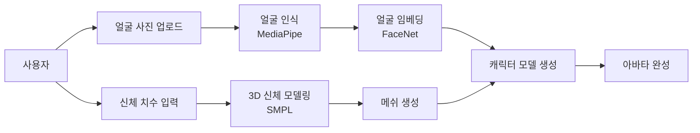
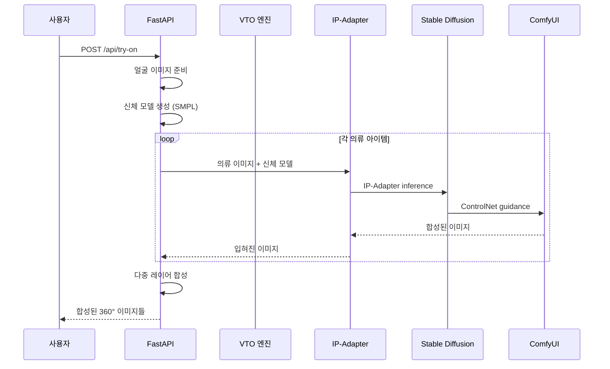
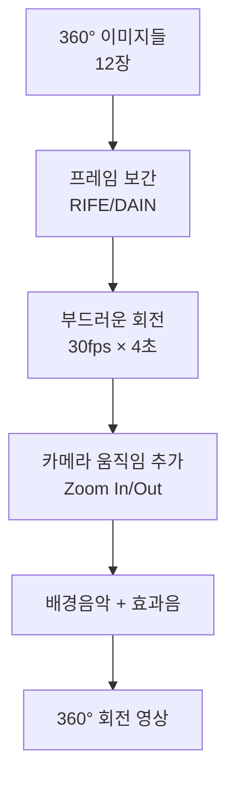
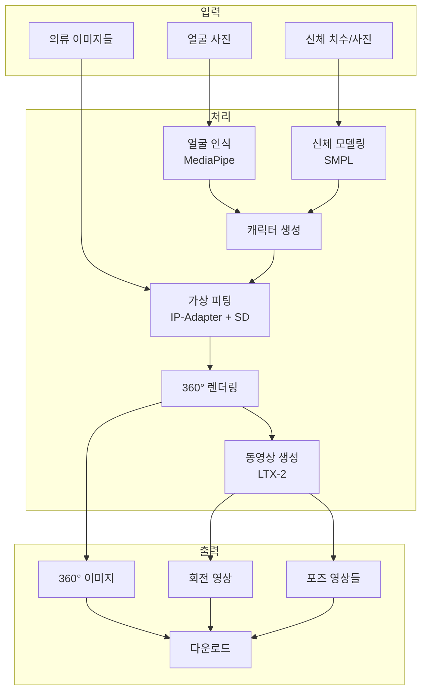
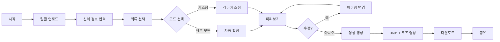

# 딸깍 패션 스튜디오 (DdalGak Fashion Studio)
## AI 가상 피팅 & 아웃핏 시뮬레이션 시스템

---

## 개요

**딸깍 패션 스튜디오**는 사용자의 신체 정보와 얼굴을 입력하면, 선택한 의류들을 자동으로 합성하여 가상으로 입혀보고, 다양한 각도에서 보여주는 동영상을 생성하는 AI 기반 패션 시뮬레이션 플랫폼입니다.

---

## 1. 시스템 개념

### 1.1 핵심 가치

```
실제 피팅 → 가상 피팅 (시간/비용 절감)
옷 직접 입어보기 → AI 합성 (즉시 결과)
단일 각도 → 360° 뷰 + 동영상
단일 아이템 → 여러 아이템 믹스 & 매치
```

### 1.2 사용자 시나리오

```
[입력] 얼굴 사진 + 신체 치수 + 옷 이미지들
    ↓
[처리] 얼굴 인식 → 신체 모델링 → 옷 합성
    ↓
[출력] 360° 회전 영상 + 다양한 포즈 영상
```

---

## 2. 핵심 기능

### 2.1 입력 시스템

#### A. 얼굴 & 신체 입력



**입력 파라미터:**

```python
# 신체 치수 입력
body_measurements = {
    "height": 170,           # 키 (cm)
    "weight": 65,            # 몸무게 (kg)
    "gender": "female",      # 성별
    "body_type": "hourglass", # 체형 (hourglass, pear, apple, rectangle)
    "skin_tone": "#F5D0C9",  # 피부톤
    "face_shape": "oval"     # 얼굴형 (oval, round, square, heart)
}

# 또는 사진에서 자동 추출
def extract_measurements_from_photo(photo: bytes) -> dict:
    """
    전신 사진에서 신체 치수 추정

    기술:
    - MediaPipe Pose: 키포인트 추출
    - 추정 알고리즘: 키/어깨너비/허리둘레 비율 계산
    """
    keypoints = mediapipe_pose.detect(photo)
    height_pixels = calculate_height(keypoints)
    shoulder_width = calculate_shoulder_width(keypoints)

    # 기준치와 비교하여 실제 치수 추정
    return estimate_real_measurements(height_pixels, shoulder_width)
```

#### B. 의류 이미지 업로드

```python
clothing_items = {
    "top": {
        "image": "top1.png",
        "category": "shirt",
        "color": "blue",
        "sleeve_length": "long"
    },
    "bottom": {
        "image": "pants1.png",
        "category": "pants",
        "color": "black",
        "length": "full"
    },
    "outer": {
        "image": "jacket1.png",
        "category": "jacket",
        "color": "beige"
    },
    "shoes": {
        "image": "shoes1.png",
        "category": "sneakers",
        "color": "white"
    }
}
```

---

### 2.2 AI 합성 엔진

#### A. 가상 피팅 (Virtual Try-On)



**기술 스택:**

| 기술 | 용도 | 설명 |
|------|------|------|
| IP-Adapter | 이미지-프롬프트 제어 | 의류 스타일 유지 |
| ControlNet | 포즈/깊이 제어 | 신체 형태 유지 |
| LoRA | 스타일 전이 | 의류 질감 재현 |
| Inpainting | 영역 교체 | 옷 입히기 |

#### B. 합성 파이프라인

```python
def virtual_try_on_pipeline(
    face_image: bytes,
    body_measurements: dict,
    clothing_items: list[dict]
) -> list[Image]:
    """
    가상 피팅 파이프라인

    순서:
    1. 3D 캐릭터 생성 (SMPL)
    2. 의류별 레이어 합성
    3. 360° 뷰 생성 (8~12개 각도)
    4. 조명/그림자 추가
    """

    # STEP 1: 3D 캐릭터 생성
    character_mesh = generate_smpl_mesh(
        gender=body_measurements["gender"],
        height=body_measurements["height"],
        weight=body_measurements["weight"]
    )

    # 얼굴 합성
    character_with_face = swap_face_on_mesh(
        mesh=character_mesh,
        face_image=face_image
    )

    # STEP 2: 360° 각도 생성
    angles = [0, 30, 60, 90, 120, 150, 180, 210, 240, 270, 300, 330]
    character_views = []

    for angle in angles:
        rendered = render_character_from_angle(
            mesh=character_with_face,
            angle=angle,
            pose="standing"  # 또는 다양한 포즈
        )
        character_views.append(rendered)

    # STEP 3: 의류 합성 (레이어별)
    layer_order = ["bottom", "top", "outer", "shoes", "accessories"]

    final_images = []

    for base_view in character_views:
        current_image = base_view

        for layer in layer_order:
            if layer not in clothing_items:
                continue

            clothing = clothing_items[layer]

            # ControlNet 포즈 추출
            pose_map = extract_pose_map(current_image)

            # IP-Adapter 스타일 추출
            clothing_style = extract_clothing_style(clothing["image"])

            # 합성
            current_image = stable_diffusion_inpaint(
                base_image=current_image,
                clothing_image=clothing["image"],
                pose_map=pose_map,
                style_embedding=clothing_style,
                mask=generate_clothing_mask(pose_map, layer)
            )

        final_images.append(current_image)

    return final_images
```

#### C. 워크플로우 (ComfyUI JSON 구조)

```json
{
  "prompt": {
    "1": {
      "inputs": {
        "image": "character_render.png",
        "upload": "image"
      },
      "class_type": "LoadImage"
    },
    "2": {
      "inputs": {
        "image": "top_clothing.png",
        "upload": "image"
      },
      "class_type": "LoadImage"
    },
    "3": {
      "inputs": {
        "pose_map": ["1", 0]
      },
      "class_type": "ControlNetPose"
    },
    "4": {
      "inputs": {
        "clothing_style": ["2", 0],
        "strength": 0.8
      },
      "class_type": "IPAdapter"
    },
    "5": {
      "inputs": {
        "positive": "wearing {{clothing}}, realistic fabric, proper fit",
        "negative": "distorted, floating, bad proportions",
        "model": ["6", 0],
        "positive_cond": ["4", 0],
        "negative_cond": ["3", 1]
      },
      "class_type": "KSampler"
    },
    "6": {
      "inputs": {
        "ckpt_name": "sdxl_vae.safetensors"
      },
      "class_type": "CheckpointLoader"
    }
  }
}
```

---

### 2.3 동영상 생성

#### A. 360° 회전 영상



```python
def create_360_rotation_video(
    character_images: list[Image],
    duration: float = 4.0,
    fps: int = 30
) -> Video:
    """
    360° 회전 영상 생성

    기술:
    - RIFE: 실시간 프레임 보간
    - FFmpeg: 영상 인코딩
    """
    # 입력: 12장의 이미지 (30° 간격)
    # 보간: 각각 사이 7장 추가 → 120프레임
    # 출력: 4초 @ 30fps

    interpolated = []
    for i in range(len(character_images)):
        curr = character_images[i]
        next_img = character_images[(i + 1) % len(character_images)]

        # RIFE 보간
        mid_frames = rife_interpolate(curr, next_img, num_frames=7)
        interpolated.extend([curr] + mid_frames)

    # FFmpeg로 비디오 생성
    return create_video_from_frames(
        frames=interpolated,
        fps=fps,
        codec="libx264",
        preset="medium",
        crf=18
    )
```

#### B. 다양한 포즈 영상

```python
POSES = {
    "walking": "걷기 (측면)",
    "turning": "뒤돌아보기",
    "waving": "손 흔들기",
    "casual": "캐주얼 스탠딩",
    "sitting": "앉아있기",
    "cross_legged": "다리 꼬고 앉기"
}

def generate_pose_videos(
    base_character: dict,
    poses: list[str] = ["walking", "turning", "waving"],
    clothing_items: dict = None
) -> dict:
    """
    다양한 포즈 영상 생성

    순서:
    1. SMPL 포즈 파라미터 로드
    2. 각 포즈별 렌더링
    3. 의류 합성
    4. I2V (LTX-2)로 영상 생성
    """
    videos = {}

    for pose_name in poses:
        # SMPL 포즈 파라미터
        pose_params = load_pose_parameters(pose_name)

        # 포즈 적용 메쉬 생성
        posed_mesh = apply_pose_to_smpl(
            base_character["mesh"],
            pose_params
        )

        # 렌더링
        rendered = render_mesh(posed_mesh, angle=0)

        # 의류 합성
        dressed = apply_clothing_to_pose(
            rendered,
            clothing_items,
            pose_name
        )

        # I2V로 영상 생성
        video = ltx2_generate_video(
            image=dressed,
            prompt=f"{pose_name} motion, smooth, natural",
            duration=2.0
        )

        videos[pose_name] = video

    return videos
```

---

### 2.4 믹스 & 매치 추천

#### A. AI 스타일 추천

```python
def recommend_outfit(
    user_preferences: dict,
    season: str = "spring",
    occasion: str = "casual"
) -> dict:
    """
    AI 스타일 추천 시스템

    입력:
    - user_preferences: 선호 색상, 스타일
    - season: 계절
    - occasion: 용도 (casual, business, party)

    출력:
    - 추천 의류 조합
    - 컬러 팔레트
    - 스타일 가이드
    """
    system_prompt = """
    당신은 패션 스타일리스트입니다.
    사용자의 취향과 상황에 맞는 코디를 추천해주세요.

    출력 형식 (JSON):
    {
        "top": {"category": "shirt", "color": "...", "style": "..."},
        "bottom": {"category": "pants", "color": "...", "style": "..."},
        "outer": {...},
        "shoes": {...},
        "accessories": [...],
        "color_palette": ["#...", "#...", "#..."],
        "style_description": "전체 스타일 설명"
    }
    """

    response = gemini_generate(
        system_instruction=system_prompt,
        user_input={
            "preferences": user_preferences,
            "season": season,
            "occasion": occasion
        }
    )

    return parse_recommendation(response)
```

#### B. 옷장 관리 (Digital Closet)

```python
# 사용자 옷장 DB 구조
user_closet = {
    "user_id": "user123",
    "items": [
        {
            "id": "item_001",
            "category": "top",
            "subcategory": "shirt",
            "color": "blue",
            "brand": "Uniqlo",
            "size": "M",
            "image_path": "/closet/user123/item_001.png",
            "purchase_date": "2026-01-15",
            "tags": ["casual", "daily", "office"]
        },
        # ... 더 많은 아이템
    ],
    "outfits": [
        {
            "id": "outfit_001",
            "name": "오피스 룩",
            "items": ["item_001", "item_015", "item_023"],
            "occasion": "business",
            "season": "all"
        }
    ]
}
```

---

## 3. 기술 아키텍처

### 3.1 전체 구성도



### 3.2 API 설계

```
POST /api/fashion/character
    - 얼굴 이미지, 신체 치수 입력
    - 3D 캐릭터 생성
    Response: {character_id, preview_image}

POST /api/fashion/try-on
    - character_id, clothing_items
    - 가상 피팅 수행
    Response: {images: [...], try_on_id}

GET /api/fashion/360/{try_on_id}
    - 360° 회전 영상
    Response: {video_url, duration}

POST /api/fashion/pose-video
    - try_on_id, pose_name
    - 특정 포즈 영상 생성
    Response: {video_url}

POST /api/fashion/recommend
    - user_preferences, season, occasion
    - 스타일 추천
    Response: {outfit_suggestion}

GET /api/fashion/closet
    - 사용자 옷장 조회
    Response: {items: [...], outfits: [...]}

POST /api/fashion/closet/item
    - 의류 아이템 추가
    Response: {item_id}
```

---

## 4. 구현 로드맵

### Phase 1: MVP (6주)

| 주차 | 개발 항목 | 상세 내용 |
|------|-----------|-----------|
| 1주차 | 얼굴/신체 입력 | MediaPipe, SMPL 기본 구현 |
| 2주차 | 캐릭터 생성 | 3D 메쉬 렌더링 |
| 3주차 | 단일 의류 합성 | IP-Adapter + Stable Diffusion |
| 4주차 | 360° 렌더링 | 다각도 이미지 생성 |
| 5주차 | 회전 영상 | RIFE 보간 + FFmpeg |
| 6주차 | 웹 UI | 업로드, 미리보기, 다운로드 |

### Phase 2: 고급 기능 (4주)

| 주차 | 개발 항목 | 상세 내용 |
|------|-----------|-----------|
| 7주차 | 다중 의류 합성 | 레이어별 합성 |
| 8주차 | 포즈 영상 | 다양한 포즈 생성 |
| 9주차 | 스타일 추천 | AI 코디 추천 |
| 10주차 | 옷장 관리 | Digital Closet |

### Phase 3: 최적화 (2주)

| 주차 | 개발 항목 | 상세 내용 |
|------|-----------|-----------|
| 11주차 | 성능 최적화 | 캐싱, 배치 처리 |
| 12주차 | 품질 개선 | 고해상도, 조금 개선 |

---

## 5. 기존 딸깍과의 시너지

### 5.1 공통 모듈 활용

| 기존 모듈 | 패션 스튜디오 활용 |
|----------|-------------------|
| step2_images.py | 의류 이미지 생성/편집 |
| step4_video.py | I2V 영상 생성 (LTX-2) |
| step5_compose.py | 최종 영상 합성 |
| ComfyUI 연동 | VTO 워크플로우 실행 |
| 이미지 스타일 시스템 | 의류 스타일 프롬프트 |

### 5.2 새로운 모듈

```python
# app/fashion/__init__.py
from app.fashion import (
    character_generator,    # 캐릭터 생성
    virtual_tryon,          # 가상 피팅
    pose_generator,         # 포즈 생성
    style_recommender,      # 스타일 추천
    closet_manager          # 옷장 관리
)
```

---

## 6. 비즈니스 모델

### 6.1 타겟 시장

| 대상 | 니즈 | 제공 가치 |
|------|------|-----------|
| 패션 브랜드 | 마케팅 | 가상 피팅 콘텐츠 |
| 이커머스 | 전환율 | 입어보기 기능 |
| 개인 사용자 | 코디 연구 | 나만의 스타일 |
| SNS 크리에이터 | 콘텐츠 | 아바타 콘텐츠 생성 |

### 6.2 수익 모델

| 모델 | 설명 | 가격대 |
|------|------|--------|
| 프리미엄 | 월간 N회 생성 | ₩9,900/월 |
| 페이퍼뷰 | 1회당 결제 | ₩500/회 |
| B2B API | 브랜드 연동 | 문의 |
| 화보패키지 | 360°+포즈 5개 | ₩15,000/세트 |

---

## 7. 기술적 도전 과제

### 7.1 해결 과제

| 과제 | 해결 방안 |
|------|-----------|
| 의류 왜곡 | ControlNet 파인튜닝 |
| 조명 부자연스 | HDR 환경맵 적용 |
| 비율 불일치 | 신체 치수 정규화 |
| 프레임 부드러움 | RIFE 고급 보간 |
| 얼굴 희석 | FaceSwap + 표정 유지 |

### 7.2 기술 스택 추가

```json
{
  "3d_modeling": ["SMPL", "Blender Python API"],
  "pose_estimation": ["MediaPipe Pose", "OpenPose"],
  "image_synthesis": ["Stable Diffusion XL", "IP-Adapter", "ControlNet"],
  "video_generation": ["LTX-2", "RIFE"],
  "face_processing": ["MediaPipe Face Mesh", "FaceNet", "InsightFace"],
  "rendering": ["PyRender3D", "Three.js"]
}
```

---

## 8. 샘플 사용 시나리오

### 시나리오: 캐주얼 룩 생성

```
1. [입력] 사용자: 얼굴 사진 업로드, 키 170cm
2. [캐릭터] 시스템: 3D 아바타 생성
3. [선택] 사용자: 청바지, 흰 티, 운동화 선택
4. [합성] 시스템: 의류 합성
5. [미리보기] 사용자: 360° 이미지 확인
6. [영상] 시스템: 회전 영상 생성 (4초)
7. [포즈] 사용자: "걷기" 포즈 선택
8. [추가] 시스템: 걷기 영상 생성 (2초)
9. [다운로드] 사용자: 영상 다운로드

총 소요 시간: 약 3~5분
```

---

## 9. UI/UX 설계

### 9.1 화면 흐름



### 9.2 주요 화면

| 화면 | 주요 기능 |
|------|-----------|
| 캐릭터 생성 | 얼굴 스캔, 신체 입력, 미리보기 |
| 옷장 | 의류 선택, 필터, 색상 변경 |
| 피팅 | 합성 미리보기, 줌, 각도 조절 |
| 영상 | 360° 회전, 포즈 선택, 재생 |
| 공유 | SNS 업로드, 링크 복사 |

---

## 10. 결론

딸깍 패션 스튜디오는 기존 딸깍의 **이미지/동영상 생성 능력**을 활용하여, 패션 분야에 특화된 **가상 피팅 시뮬레이션** 서비스를 제공합니다.

핵심 차별점:
- ✅ 실제 사용자 얼굴/신체 기반
- ✅ 여러 의류 믹스 & 매치
- ✅ 360° 회전 + 다양한 포즈
- ✅ AI 스타일 추천
- ✅ 옷장 관리 시스템

기존 ComfyUI 인프라를 최대한 활용하면서, 패션 특화 기능(3D 모델링, VTO, 포즈 생성)을 추가한 **실용적 서비스**입니다.

---

## 변경사항

- 2026-03-10: 초안 작성
