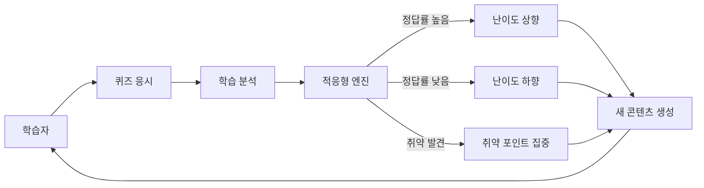
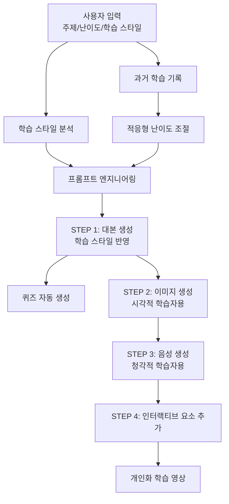
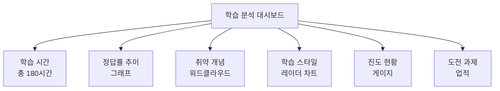
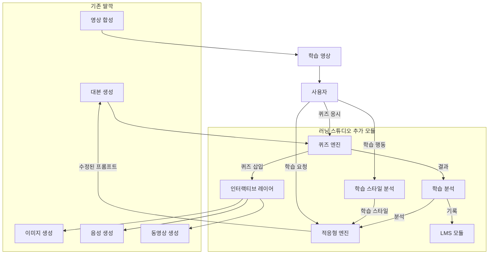

# 딸깍 러닝 스튜디오 (DdalGak Learning Studio)
## 능동형 학습 시스템 제안서

---

## 개요

**딸깍 러닝 스튜디오**는 기존 딸깍 시스템을 발전시켜, 사용자가 능동적으로 학습 콘텐츠를 생성하고 개인화된 학습 경험을 제공하는 AI 기반 교육 플랫폼입니다.

---

## 1. 시스템 개념

### 1.1 핵심 가치

```
수동적 시청 → 능동적 학습
일방향 전달 → 개인화된 콘텐츠
동일 영상 → 적응형 난이도
```

### 1.2 목표 사용자

| 대상 | 니즈 | 제공 기능 |
|------|------|-----------|
| 자기주도학습자 | 맞춤형 학습 콘텐츠 | 개인화 난이도, 퀴즈 생성 |
| 교육기관 | 대량 콘텐츠 생산 | 커리큘럼 자동화 |
| 기업 교육 | 직무 연동 학습 | 실무 시뮬레이션 |
| 콘텐츠 크리에이터 | 2차 창작 지원 | 요약, 번역, 재가공 |

---

## 2. 핵심 기능

### 2.1 능동형 학습 모듈

#### A. 적응형 난이도 시스템



**구현 알고리즘:**

```python
def adapt_difficulty(user_quiz_results: dict, current_script: dict) -> dict:
    """
    사용자 퀴즈 결과를 분석하여 난이도 조절

    점수 범위: 0~100
    - 90+ : 도전 과제 추가 (심화 개념)
    - 70~89 : 유지 (적정 수준)
    - 50~69 : 복습 강화 (취약 포인트 재설명)
    - 50- : 기본으로 재설정 (더 쉬운 비유)
    """
    score = user_quiz_results["average_score"]

    if score >= 90:
        prompt_modifier = {
            "difficulty": "advanced",
            "instruction": "심화 개념과 실전 응용 추가",
            "addition": "도전 과제 퀴즈 3개 추가"
        }
    elif score >= 70:
        prompt_modifier = {
            "difficulty": "maintain",
            "instruction": "현재 수준 유지"
        }
    elif score >= 50:
        weak_points = analyze_weak_points(user_quiz_results)
        prompt_modifier = {
            "difficulty": "reinforce",
            "instruction": f"취약 포인트 집중: {weak_points}",
            "addition": "복습 예제 2개 추가"
        }
    else:
        prompt_modifier = {
            "difficulty": "basic",
            "instruction": "더 쉬운 비유와 일상 예제 사용",
            "simplify": True
        }

    return modify_script_prompt(current_script, prompt_modifier)
```

#### B. 대화형 학습 모드

```
[영상 재생] → [일시정지] → [AI 질문] → [사용자 답변] → [피드백] → [재생]
```

**기술 스택:**
- 음성 인식: Whisper (OpenAI)
- 답변 평가: Gemini 2.5 Flash
- 실시간 피드백: SSE 스트리밍

#### C. 퀴즈 자동 생성

```python
def generate_quiz(script_data: dict, question_count: int = 5) -> dict:
    """
    대본에서 퀴즈 자동 생성

    입력: script_data (title, scenes)
    출력: {
        "multiple_choice": [...],
        "short_answer": [...],
        "discussion": [...]
    }
    """
    system_prompt = """
    당신은 교육 전문가입니다.
    주어진 대본을 바탕으로 다음 유형의 퀴즈를 생성하세요:

    1. 객관식 4지선다 (3개): 핵심 개념 확인
    2. 단답형 (1개): 용어 설명
    3. 서술형/토론 (1개): 심화 사고

    각 문항에 정답과 해설을 포함하세요.
    """

    # Gemini에 요청
    response = gemini_generate(
        script_summary=extract_key_points(script_data),
        question_count=question_count,
        system_instruction=system_prompt
    )

    return parse_quiz_response(response)
```

---

### 2.2 개인화 콘텐츠 생성

#### A. 학습 스타일 분석

```python
# VARK (Visual, Auditory, Read/Write, Kinesthetic) 모델 활용

LEARNING_STYLES = {
    "visual": {
        "characteristics": ["도표", "그래프", "이미지 중심"],
        "prompt_modifier": "시각적 비유와 그래프 예시를 많이 활용하세요",
        "image_ratio": "high"  # 이미지 더 많이 생성
    },
    "auditory": {
        "characteristics": ["설명", "토론", "스토리텔링"],
        "prompt_modifier": "스토리텔링과 대화 형식을 활용하세요",
        "tts_speed": 1.0  # 느린 속도
    },
    "read_write": {
        "characteristics": ["텍스트", "필기", "요약"],
        "prompt_modifier": "핵심 키워드와 요약을 자주 제시하세요",
        "subtitle_style": "emphasis"
    },
    "kinesthetic": {
        "characteristics": ["실습", "시뮬레이션", "체험"],
        "prompt_modifier": "일상 행동 예시와 실제 활용법을 설명하세요",
        "interactive": True
    }
}

def detect_learning_style(user_behavior: dict) -> str:
    """
    사용자 행동으로 학습 스타일 추론

    분석 지표:
    - 이미지 클릭/확대 빈도 → visual
    - 재생 속도 조절 → auditory
    - 자막 on/off, 캡처 → read_write
    - 실습 영상 시청 → kinesthetic
    """
    scores = {style: 0 for style in LEARNING_STYLES}

    # 행동 가중치 계산
    if user_behavior["image_zoom_count"] > 5:
        scores["visual"] += 3
    if user_behavior["subtitle_enabled"]:
        scores["read_write"] += 2
    if user_behavior["rewatch_count"] > 2:
        scores["auditory"] += 2
    if user_behavior["practice_video_watch"]:
        scores["kinesthetic"] += 3

    return max(scores, key=scores.get)
```

#### B. 맞춤형 콘텐츠 생성 파이프라인



---

### 2.3 학습 관리 시스템 (LMS)

#### A. 진도 관리

```json
{
  "user_id": "user123",
  "courses": [
    {
      "course_id": "eco_101",
      "title": "경제학 기초",
      "progress": 0.65,
      "completed_lessons": [1, 2, 3, 4, 5],
      "current_lesson": 6,
      "quiz_scores": [85, 90, 75, 95, 80],
      "average_score": 85,
      "weak_points": ["수요-공급 곡선", "인플레이션"],
      "last_studied": "2026-03-10T12:00:00",
      "study_time_total": 180
    }
  ],
  "learning_path": {
    "recommended_next": "eco_102",
    "prerequisites": ["math_101"]
  }
}
```

#### B. 학습 분석 대시보드



---

## 3. 기술 아키텍처

### 3.1 시스템 구성도



### 3.2 데이터베이스 스키마

```sql
-- 사용자 테이블
CREATE TABLE users (
    id VARCHAR(50) PRIMARY KEY,
    name VARCHAR(100),
    email VARCHAR(100),
    learning_style VARCHAR(20),  -- visual, auditory, read_write, kinesthetic
    created_at TIMESTAMP
);

-- 코스 테이블
CREATE TABLE courses (
    id VARCHAR(50) PRIMARY KEY,
    title VARCHAR(200),
    description TEXT,
    difficulty VARCHAR(20),  -- beginner, intermediate, advanced
    category VARCHAR(50),
    created_at TIMESTAMP
);

-- 학습 진도 테이블
CREATE TABLE user_progress (
    id SERIAL PRIMARY KEY,
    user_id VARCHAR(50) REFERENCES users(id),
    course_id VARCHAR(50) REFERENCES courses(id),
    lesson_id INTEGER,
    completed BOOLEAN DEFAULT FALSE,
    quiz_score INTEGER,
    study_time INTEGER,  -- 초 단위
    last_accessed TIMESTAMP,
    UNIQUE(user_id, course_id, lesson_id)
);

-- 퀴즈 결과 테이블
CREATE TABLE quiz_results (
    id SERIAL PRIMARY KEY,
    user_id VARCHAR(50) REFERENCES users(id),
    lesson_id INTEGER,
    question_id INTEGER,
    user_answer TEXT,
    is_correct BOOLEAN,
    time_spent INTEGER,  -- 초 단위
    attempted_at TIMESTAMP
);

-- 학습 행동 로그 테이블
CREATE TABLE learning_logs (
    id SERIAL PRIMARY KEY,
    user_id VARCHAR(50) REFERENCES users(id),
    lesson_id INTEGER,
    action VARCHAR(50),  -- play, pause, seek, speed_change, subtitle_toggle
    metadata JSON,  -- {"speed": 1.5, "position": 120}
    timestamp TIMESTAMP
);
```

---

## 4. 구현 로드맵

### Phase 1: 기능 개발 (4주)

| 주차 | 개발 항목 | 상세 내용 |
|------|-----------|-----------|
| 1주차 | 퀴즈 엔진 | 대본에서 퀴즈 자동 생성 |
| 2주차 | 적응형 엔진 | 난이도 조절 알고리즘 |
| 3주차 | 학습 스타일 분석 | VARK 모델 구현 |
| 4주차 | LMS 기본 기능 | 진도 관리, 결과 저장 |

### Phase 2: UI/UX (3주)

| 주차 | 개발 항목 | 상세 내용 |
|------|-----------|-----------|
| 5주차 | 학습 모드 선택 | 일반/대화형/퀴즈 모드 |
| 6주차 | 대시보드 | 학습 분석 시각화 |
| 7주차 | 인터랙티브 플레이어 | 영상 내 퀴즈 삽입 |

### Phase 3: 고급 기능 (3주)

| 주차 | 개발 항목 | 상세 내용 |
|------|-----------|-----------|
| 8주차 | AI 튜터 | 실시간 질답 시스템 |
| 9주차 | 소셜 학습 | 그룹 학습, 토론 |
| 10주차 | 게이미피케이션 | 업적, 뱃지, 리더보드 |

---

## 5. 기존 딸깍과의 차별점

| 항목 | 기존 딸깍 | 러닝 스튜디오 |
|------|----------|--------------|
| 목적 | 콘텐츠 생산 | 학습 경험 |
| 대상 | 크리에이터 | 학습자 |
| 출력 | 영상 1개 | 영상 + 퀴즈 + 분석 |
| 개인화 | 카테고리 선택 | 학습 스타일 + 난이도 |
| 상호작용 | 수동 시청 | 능동적 참여 |
| 피드백 | 없음 | 실시간 분석 |

---

## 6. 비즈니스 모델

### 6.1 타겟 시장

1. **B2B**: 교육기관, 기업 교육, 학원
2. **B2C**: 자기주도학습자, 취업 준비생
3. **B2B2C**: 교육 콘텐츠 제작사

### 6.2 수익 모델

| 모델 | 설명 | 가격대 |
|------|------|--------|
| 구독형 | 월간 학습 무제한 | ₩29,000/월 |
| 과목별 | 특정 과금 구매 | ₩50,000/과목 |
| 기업용 | 팀/부서 단위 라이선스 | 문의 |
| API | 학습 분석 API 제공 | 사용량 기반 |

---

## 7. 성공 지표 (KPI)

| 지표 | 목표 | 측정 방법 |
|------|------|-----------|
| 학습 완료율 | 70% 이상 | 완료 코스 / 시작 코스 |
| 정답률 향상 | +20% | 사전/사후 테스트 비교 |
| 재방문율 | 50% 이상 | 30일 내 재방문 |
| 학습 시간 | 주당 3시간 이상 | 평균 학습 시간 |
| 만족도 | 4.5/5.0 | NPS 설문 |

---

## 8. 기술적 도전 과제

### 8.1 해결 과제

| 과제 | 해결 방안 |
|------|-----------|
| 퀴즈 품질 | Few-shot Learning, 프롬프트 엔지니어링 |
| 학습 스타일 분석 정확도 | 행동 데이터 축적, ML 모델 학습 |
| 실시간 피드백 | SSE, WebSocket 활용 |
| 개인화 스케일링 | 캐싱 전략, 배치 처리 |

### 8.2 기술 스택 추가

```
# 새로운 의존성
- langchain: 퀴즈 생성 체인
- pinecone: 학습 데이터 벡터 검색
- supabase: 실시간 데이터베이스
- plotly: 대시보드 시각화
- websockets: 실시간 상호작용
```

---

## 9. 샘플 사용 시나리오

### 시나리오: 경제학 초급 학습

```
1. [입력] 사용자: "경제학 기초" 선택, 학습 스타일: 시각적
2. [분석] 시스템: 그래프/도표 많이 생성하도록 프롬프트 수정
3. [생성] STEP 1: 대본 (그래프 중심 비유)
4. [생성] STEP 2: 이미지 (인포그래픽 스타일)
5. [생성] STEP 3: 퀴즈 5개 자동 생성
6. [학습] 사용자: 영상 시청 + 퀴즈 응시
7. [분석] 시스템: 정답률 65% → "수요-공급" 취약
8. [적응] 시스템: 취약 포인트 복습 영상 생성
9. [재학습] 사용자: 복습 영상 시청 → 정답률 85%
10. [완료] 시스템: 다음 레벨 추천
```

---

## 10. 결론

딸깍 러닝 스튜디오는 기존 딸깍의 콘텐츠 생산 능력에 **능동형 학습**과 **개인화** 기능을 더하여, 단순한 영상 생성 도구를 넘어 **AI 기반 교육 플랫폼**으로 진화시킵니다.

핵심 차별점:
- ✅ 학습자 중심 설계
- ✅ 적응형 난이도 조절
- ✅ 실시간 분석과 피드백
- ✅ 능동적 참여 유도

기존 딸깍 인프라를 최대한 활용하면서, 교육 전문성을 더한 파생 product로서 충분한 경쟁력이 있습니다.

---

## 변경사항

- 2026-03-10: 초안 작성
