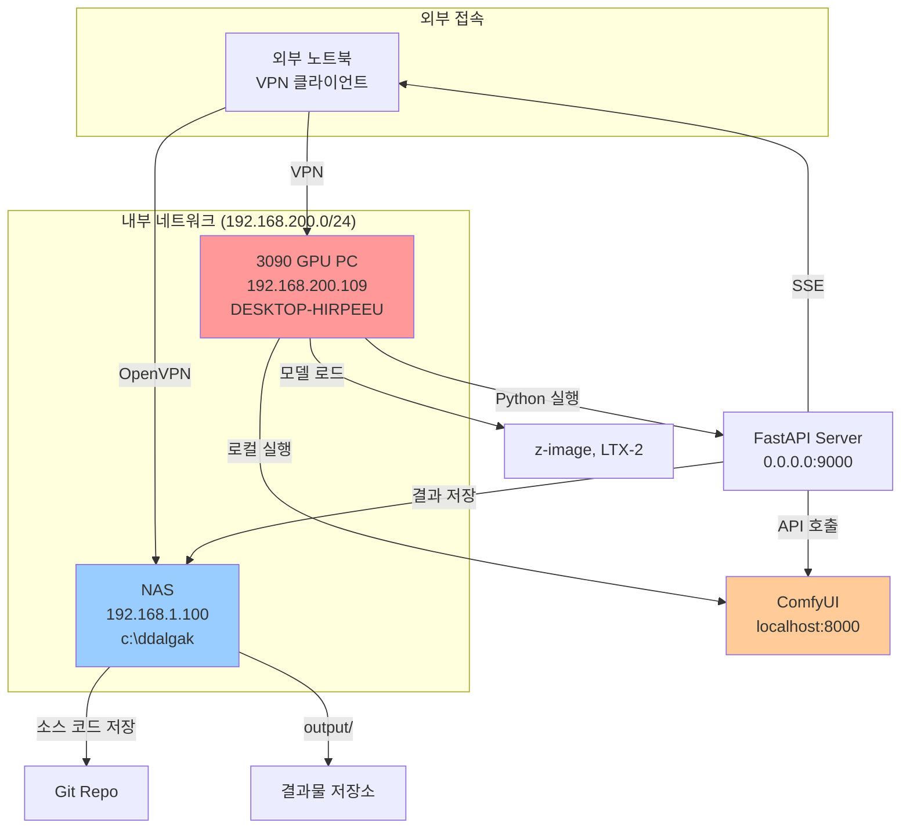
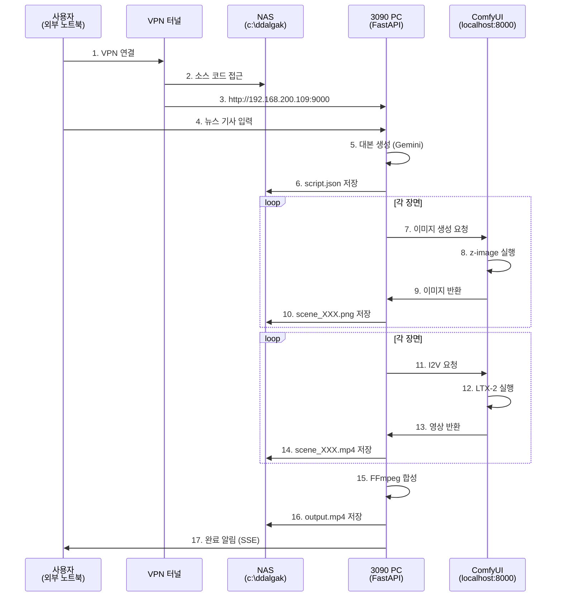

# 딸깍 (DdalGak) - 개선 로드맵

> 추후 반영할 개선 사항 정리

---

## 0. 시스템 아키텍처 (현재 작업 환경)

### 0.1 현재 작업 환경 구성



### 0.2 네트워크 설정 상세

| 장비 | IP 주소 | 역할 | 비고 |
|------|---------|------|------|
| **3090 GPU PC** | 192.168.200.109 | 메인 서버 | 현재 작업 머신 (DESKTOP-HIRPEEU) |
| **NAS** | 192.168.1.100 | 소스 저장소 | VPN 서버, 네트워크 공유 폴더 |
| **ComfyUI** | localhost:8000 | 이미지/영상 생성 | 3090 PC 로컬에서만 실행 |

### 0.3 데이터 흐름



### 0.4 환경 변수 설정

#### 필수 API 키 (.env)

```bash
# Gemini API (대본 생성, ITV 프롬프트, 메타데이터)
GEMINI_API_KEY=your_gemini_api_key

# Replicate API (이미지 생성 대체)
REPLICATE_API_TOKEN=your_replicate_token

# ElevenLabs API (고급 TTS)
ELEVENLABS_API_KEY=your_elevenlabs_api_key

# ComfyUI URL (로컬 또는 원격)
COMFYUI_BASE_URL=http://localhost:8000
```

### 0.5 권장 작업 워크플로우

#### 새 세션 시작 시

1. **VPN 연결** (외부 노트북에서)
2. **ComfyUI 실행** (3090 PC)
   ```bash
   cd C:\Users\magicyi\AppData\Local\Programs\ComfyUI
   python main.py --listen 0.0.0.0 --port 8000
   ```

3. **서버 실행** (프로젝트 경로에서)
   ```bash
   cd c:\ddalgak
   venv\Scripts\activate
   python run.py
   ```

4. **웹 접속** (브라우저에서)
   - http://localhost:9000 (로컬)
   - http://192.168.200.109:9000 (내부망)

---

## 1. ComfyUI 네트워크 구성 변경

### 현재 상황
- ComfyUI가 3090가 탑재된 로컬 컴퓨터에서 실행 중
- `localhost:8000`으로 접근
- Python 서버와 같은 컴퓨터에서만 사용 가능

### 개선 방안
- ComfyUI를 **원격 서버**로 분리하여 네트워크 내 다른 컴퓨터에서 접근 가능하게 변경
- ComfyUI 실행 시 `--listen 0.0.0.0` 옵션으로 외부 접근 허용
- 환경설정(`.env`)에서 ComfyUI 서버 주소를 설정 가능하게

### 구현 항목
- [x] `config.py`에 `COMFYUI_BASE_URL` 환경변수 추가
- [x] 기본값: `http://localhost:8000`
- [x] 네트워크 IP 예: `http://192.168.1.100:8000`
- [x] `step2_images.py`, `step4_video.py`에서 환경변수 사용하도록 수정

### 변경사항
- 2026-03-10: ComfyUI 원격 접속 설정 완료

---

## 2. 서버 외부 접근 허용

### 현재 상황
- 서버가 `localhost:9000` (127.0.0.1)에서만 실행
- 같은 네트워크의 다른 기기에서 접근 불가

### 개선 방안
- `run.py`에서 host를 `0.0.0.0`으로 변경하여 외부 접근 허용
- 방화벽 설정 안내 추가

### 구현 항목
- [ ] `run.py`의 host 이미 `0.0.0.0`으로 되어 있음 (확인 완료)
- [ ] 사용자가 현재 컴퓨터의 IP를 알 수 있도록 웹 UI에 표시
- [ ] `.env`에 `SERVER_IP` 자동 감지 또는 수동 설정 옵션

### 사용자 가이드 추가
```powershell
# 내 IP 확인
ipconfig

# 다른 기기에서 접속
http://[서버컴퓨터IP]:9000
```

---

## 3. 이미지 생성 기능 강화

### 현재 상황
- 텍스트 프롬프트만 입력 가능
- 고정된 스타일 프리셋만 사용

### 개선 방안

#### 3.1 샘플/레퍼런스 이미지 업로드
- 사용자가 참고 이미지를 업로드하여 스타일 반영
- Image-to-Image (img2img) 기능 활용

#### 3.2 다양한 스타일 옵션
- 사용자 정의 스타일 프리셋 저장/불러오기
- 스타일 강도 조절 (strength 파라미터)
- 네거티브 프롬프트 입력 필드

#### 3.3 추가 파라미터
- 이미지 비율 선택 (16:9, 9:16, 1:1, 4:3)
- 해상도 선택 (720p, 1080p, 4K)
- 생성 수 선택 (여러 버전 생성 후 선택)

### 구현 항목
- [ ] 프론트엔드: 이미지 업로드 UI (`step2` 페이지)
- [ ] 백엔드: `step2_images.py`에 이미지 업로드 처리
- [ ] ComfyUI 워크플로우에 img2img 노드 추가
- [ ] 스타일 프리셋 CRUD API
- [ ] 파라미터 입력 폼 확장

---

## 4. 동영상 생성 기능 개선

### 현재 상황
- 첫 번째 장면만 동영상으로 생성 (나머지는 정적 이미지)
- 장면 간 전환 매끄럽지 않음
- 카메라 무브먼트(패닝, 줌) 없음

### 개선 방안

#### 4.1 선택적 동영상 생성
- 사용자가 동영상을 생성할 장면을 선택
- "전체 생성", "N개만 생성", "특정 장면만 생성" 옵션

#### 4.2 장면 간 트랜지션
- Crossfade, Fade to Black, Dissolve 등 트랜지션 효과
- FFmpeg `xfade` 필터 활용

#### 4.3 카메라 무브먼트
- 정적 이미지에 Ken Burns 효과:
  - Slow Zoom In
  - Slow Zoom Out
  - Pan Left to Right
  - Pan Right to Left
  - Random Movement

#### 4.4 L2 일관성 향상
- 첫 번째 장면과 두 번째 장면을 연결되도록 생성
- "continuing from previous shot" 프롬프트 자동 추가

### 구현 항목
- [ ] `step4_video.py`: 장면 선택 옵션 추가
- [ ] `step5_compose.py`: FFmpeg xfade 필터 적용
- [ ] `step5_compose.py`: 정적 이미지에 zoom/pan 효과 (FFmpeg `zoompan` 필터)
- [ ] `step4_video.py`: 장면 간 연결 프롬프트 자동 생성

---

## 5. UI/UX 개선

### 현재 상황
- 진행 상태가 텍스트로만 표시
- 작업 중인 단계가 직관적이지 않음
- 에러 메시지가 불친절함

### 개선 방안

#### 5.1 프로그레스 바 인디케이터
- 각 STEP별 진행률 표시 (0-100%)
- 전체 파이프라인 진행률 시각화
- 완료된 단계 체크마크 표시

#### 5.2 실시간 미리보기
- 생성 중인 이미지/영상 실시간 미리보기
- 오디오 파형 웨이브폼 표시
- 타임라인 시각화

#### 5.3 직관적인 에러 메시지
- 사용자 친화적인 에러 메시지
- 해결 방법 제시
- API 오류 시 상세 정보 토글

#### 5.4 다크 모드
- 다크/라이트 모드 토글
- 사용자 설정 저장 (localStorage)

#### 5.5 키보드 단축키
- 단축키 가이드
- 재생/일시정지, 다음/이전 장면 등

### 구현 항목
- [ ] `templates/index.html`: 프로그레스 바 컴포넌트
- [ ] `static/main.js`: SSE 이벤트 핸들링 개선
- [ ] 에러 메시지 컴포넌트 (토스트/모달)
- [ ] 다크 모드 CSS (`static/style.css`)
- [ ] 단축키 이벤트 리스너

---

## 6. 배경음악 (BGM) 추가 기능

### 현재 상황
- 나레이션 오디오만 존재
- 배경음악 없음

### 개선 방안

#### 6.1 BGM 소스
- 무료 저작권 음원库 연동 (예: YouTube Audio Library, FreePD)
- 사용자 업로드 기능
- AI 생성 배경음악 (MusicGen 등)

#### 6.2 BGM 설정
- 음원 선택/업로드
- 볼륨 조절 (나레이션과의 믹스 비율)
- 페이드 인/아웃 설정
- 특정 장면에만 BGM 적용

#### 6.3 오디오 믹싱
- FFmpeg `amix` 필터로 나레이션 + BGM 믹스
- 나레이션 구간 자동 감지하여 볼륨 조절 (sidechain 효과)

### 구현 항목
- [ ] `config.py`: BGM 관련 환경변수
- [ ] `step5_compose.py`: BGM 믹싱 로직
- [ ] 프론트엔드: BGM 선택 UI
- [ ] BGM 파일 관리 (`output/{project_id}/bgm/`)
- [ ] MusicGen API 연동 (선택사항)

---

## 우선순위

### P0 (즉시 필요)
1. **서버 외부 접근 허용** - 협업에 필수
2. **UI 진행률 인디케이터** - 사용자 경험 개선

### P1 (조기 개선)
1. **ComfyUI 네트워크 구성** - 리소스 분리
2. **장면 간 트랜지션** - 영상 품질 개선
3. **에러 메시지 개선** - 디버깅 편의성

### P2 (중기 개선)
1. **이미지 업로드 기능** - 크리에이티브 자유도
2. **카메라 무브먼트** - 영상 역동성
3. **BGM 추가** - 완성도 향상

### P3 (장기 개선)
1. **사용자 정의 스타일 시스템**
2. **다크 모드**
3. **AI 배경음악 생성**

---

## 기술 노트

### ComfyUI 원격 접속 설정
```bash
# ComfyUI 서버 (3090 컴퓨터)
python main.py --listen 0.0.0.0 --port 8000
```

### FFmpeg 트랜지션 예시
```bash
# Crossfade 1초
ffmpeg -i scene1.mp4 -i scene2.mp4 -filter_complex \
  "[0:v][1:v]xfade=transition=fade:duration=1:offset=9" \
  output.mp4
```

### FFmpeg Ken Burns 효과
```bash
# Zoom In 효과
ffmpeg -i input.jpg -vf "zoompan=z='min(zmax,z+0.0015)':d=700:x='iw/2-(iw/zoom/2)':y='ih/2-(ih/zoom/2)'" \
  -t 5 output.mp4
```

### FFmpeg 오디오 믹싱
```bash
# 나레이션 + BGM 믹스
ffmpeg -i narration.mp3 -i bgm.mp3 -filter_complex \
  "[0:a][1:a]amix=inputs=2:weights=0.8 0.3" \
  mixed.mp3
```

---

## 변경사항

- 2026-03-10: 초안 작성
